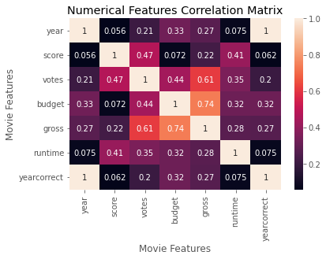
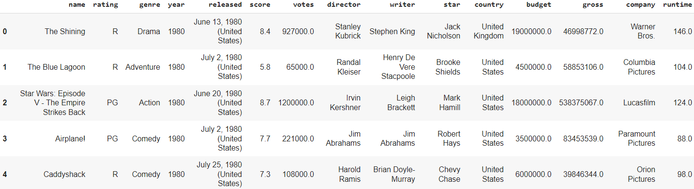
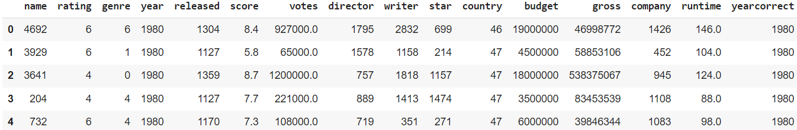
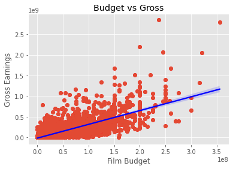

# Movies-Correlation-Analysis
Understanding the high correlations between the quantitative and categorical features of [movies released between 1980 - 2020](https://www.kaggle.com/datasets/danielgrijalvas/movies).

#### Datatypes:

```sh
name         object
rating       object
genre        object
year          int64
released     object
score       float64
votes       float64
director     object
writer       object
star         object
country      object
budget      float64
gross       float64
company      object
runtime     float64
dtype: object
```








#### Highly Correlated Numerical & Categorical Features:

```sh
gross        votes          0.614751 (61.47%)
budget       gross          0.740247 (74.02%)
dtype: float64
```


